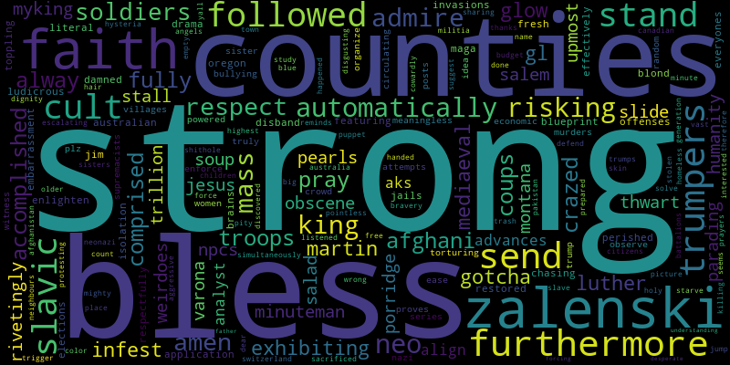
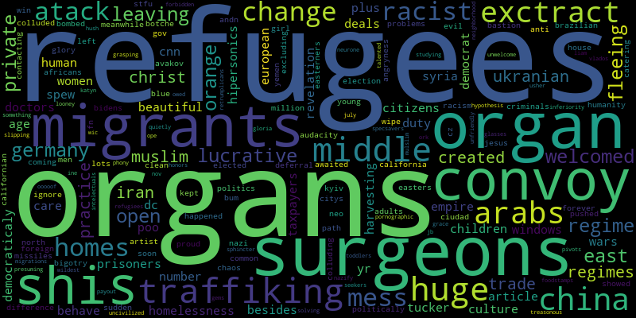
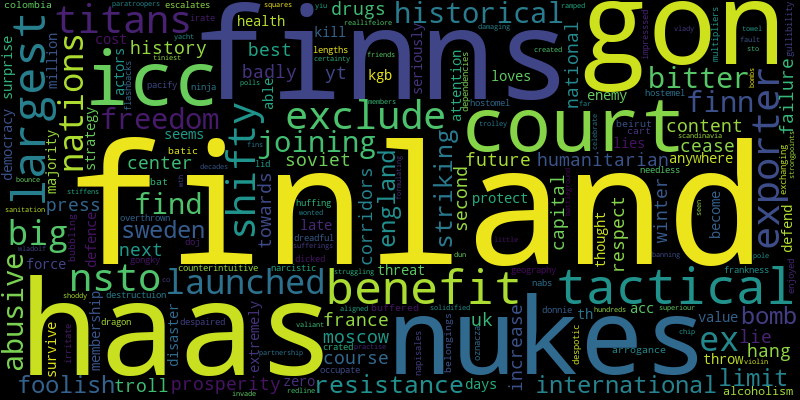
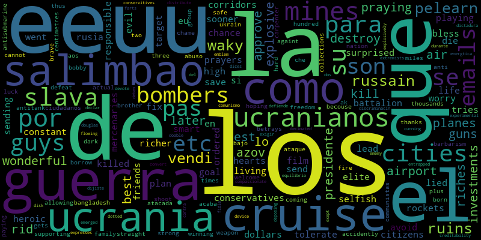
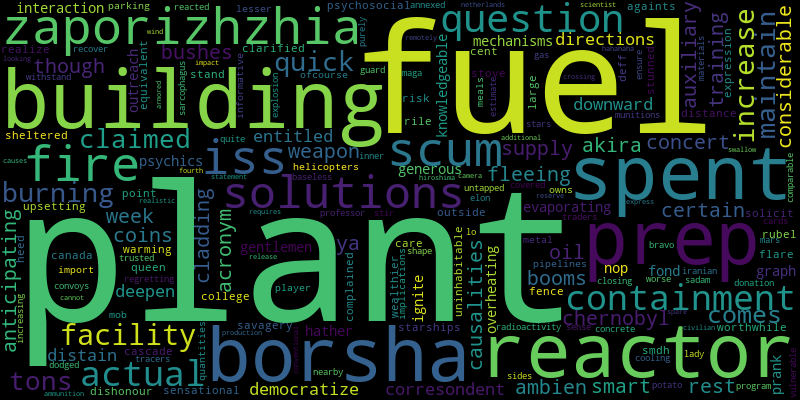
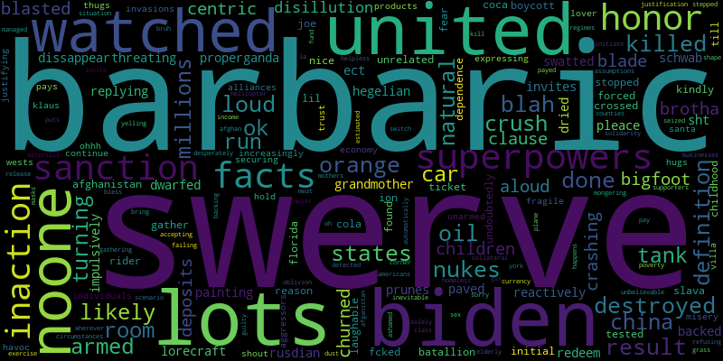
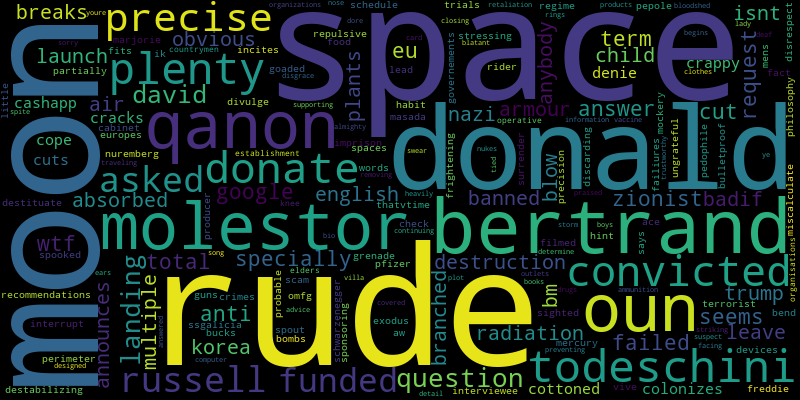
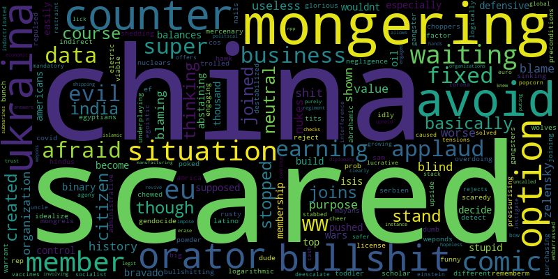
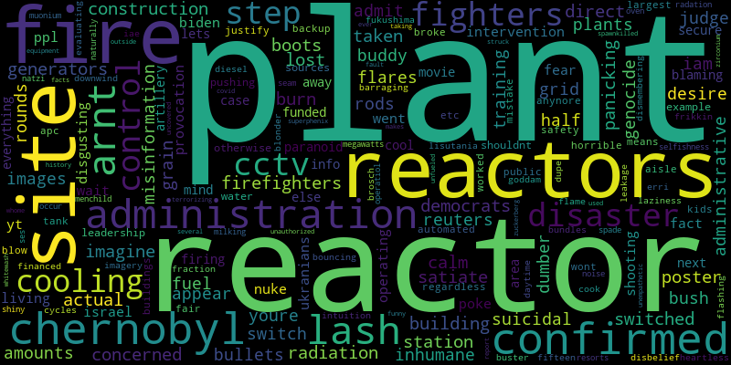
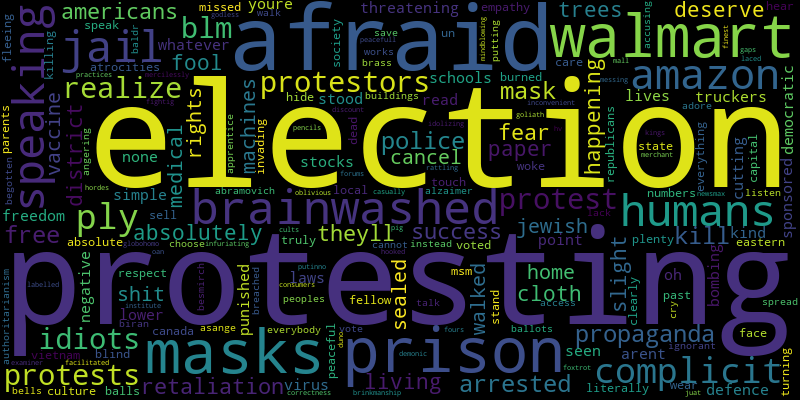

# YT-Comments-WordClouds

__Protests Around The World In Support Of Ukraine__  
As Ukrainians come together, protesters around the world are using their voices to call for an end to Russia’s attacks  
https://www.youtube.com/watch?v=r0FuHDeIZZM

 
 
__Ukrainians strike massive Russian convoy, Pentagon says__  
The US believes a 40-mile-long Russian military convoy outside of Kyiv is “stalled,” a senior US defense official says.  
https://www.youtube.com/watch?v=IsBc_Vbt1Uw

 
 
__Putin's war: Who's next after Ukraine? | Conflict Zone special edition__  
Will the Russian war in Ukraine spread to neighboring countries?  
https://www.youtube.com/watch?v=hXo0rkQF8K8

 
 
__How is the war in Ukraine going for Russia? | DW News__  
British military intelligence souces say Russian forces are now deliberately targeting areas populated by civilians  
https://www.youtube.com/watch?v=f1po2OdNnIc  

 
 
__Russia in control of Ukraine nuclear plant after attack__  
https://www.youtube.com/watch?v=UxuH0MxtZII

 
 
__Ukraine releases video of Russian helicopter being shot down__  
The area where it was filmed includes a base where the Russians have been running helicopter operations and  
has recently been under attack by Ukrainian forces.  
https://www.youtube.com/watch?v=3a3PQgD-LrA

 
 
__Russia Ukraine conflict: Europe’s biggest nuclear power plant attacked__  
A fire has broken out at the site of Europe’s largest nuclear power plant after an attack by Russian forces  
in Ukraine. The blaze has been extinguished, but Ukrainian authorities say Russia is now in control of the  
plant. World leaders have condemned the attack as “horrific and reckless".  
https://www.youtube.com/watch?v=OHGKR8j2Ouo

 
 
__NATO rejects Ukraine's 'no-fly zone' request | Latest English News | World News | WION__  
Russia's invasion of Ukraine has sparked global condemnation this included sanctions against Russia and  
military support to Ukraine but for the West to declare Ukraine as a no-fly zone is off the table now.  
https://www.youtube.com/watch?v=ZsqT-zHzCp8

 
 
__Ukraine nuclear plant under Russian attack__  
CNBC's Shep Smith reports that a nuclear plant in Ukraine is under attack right now, according to the  
Associated Press. It's the largest nuclear power plant in Europe.  
https://www.youtube.com/watch?v=5P6eidg59ek

 
 
__How Russians Reacted When We Showed Them Pictures From Ukraine__  
Many Russians are being fed a daily media diet of Kremlin propaganda that hides the terrible destruction  
and human cost of their country's invasion of Ukraine. So how did ordinary Russians in Perm and  
Vladivostok react when Current Time reporters showed them some images?  
https://www.youtube.com/watch?v=kELta9MLOzg  

